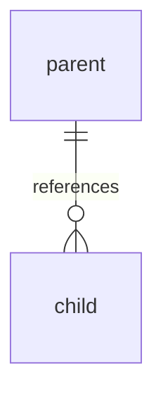

# Blueprints Database Schema Documentation

Automatically generate nicely formatted markdown documentation of the Blueprints SQLite database, including detailed column definitions and visual relationship diagrams with foreign keys.

## Quick start

```bash
cd /root/xarta-node/.claude/skills/blueprints-schema-doc
./generate-schema-doc.sh
```

Output files are created in your current working directory:
- **`blueprints-schema.md`** — Complete schema with all tables, columns, types, nullability, defaults, and relationships
- **`blueprints-schema-diagram.md`** — Mermaid ER diagram showing table structure and relationships

## What it generates

### blueprints-schema.md

A comprehensive markdown reference with:

1. **Relationships Summary** — Quick list of all detected foreign key relationships
2. **Per-table documentation** — For each table:
   - Column name and data type
   - Nullability indicator (✓ = nullable, ✗ = not null)
   - Default value (if any)
   - Primary key markers (**PK**)
   - Foreign key annotations pointing to target tables (e.g., `→ nodes(node_id)`)

Example table excerpt:
```markdown
## `machines`

| Column | Type | Null? | Default | Notes |
|--------|------|:-----:|---------|-------|
| `machine_id` | `TEXT` | ✓ | — | **PK** |
| `name` | `TEXT` | ✗ | — | — |
| `parent_machine_id` | `TEXT` | ✓ | — | → `machines(machine_id)` |
| `created_at` | `TEXT` | ✓ | `datetime('now')` | — |
```

### blueprints-schema-diagram.md

A Mermaid Entity-Relationship (ER) diagram showing:
- All tables and their columns with types
- Primary keys marked with **PK**
- Foreign key columns marked with **FK**
- Cardinality relationships (e.g., `machines ||--o{ machines`)
- Self-referential relationships

## How it works

### Relationship inference

Foreign key relationships are inferred automatically by examining column naming patterns:

- **Standard format**: `target_table_id` → matched to `target_tables` table (handles irregular plurals)
- **Prefixed format**: `parent_machine_id` → matched to `machines` table
- **Explicit format**: `target_node_id` → matched to `nodes` table

Examples detected:
```
machines.parent_machine_id     → machines.machine_id       (self-reference)
sync_queue.target_node_id      → nodes.node_id            (external)
nodes.host_machine             → (manual: not auto-detected)
services.host_machine          → (manual: not auto-detected)
```

**Note**: `host_machine` references in `nodes` and `services` are not auto-detected because `machines` is not singular-pluralized conventionally. These can be manually documented if needed.

## Database location

The script reads from: `/opt/blueprints/data/db/blueprints.db`

This is created and maintained by `setup-blueprints.sh` at runtime (not in git).

## Use cases

- **Documentation updates** — Keep schema docs in sync after migrations
- **Onboarding** — Quick visual reference for new developers
- **Migration planning** — Understand cardinality before schema changes  
- **Auditing** — Verify integrity constraints and defaults
- **Integration** — Generate docs/diagrams for external tools

## Integration with CI/CD

Run during documentation build steps:
```bash
bash /root/xarta-node/.claude/skills/blueprints-schema-doc/generate-schema-doc.sh
# Outputs to current dir; consider moving to docs/ folder
mv blueprints-schema*.md docs/
```

## Agent response contract (important)

When a user asks to **“show columns”**, **“what are the current columns”**, or similar for the Blueprints database:

1. Use this skill first (do not return raw/unformatted column dumps).
2. Read the live database at `/opt/blueprints/data/db/blueprints.db`.
3. Return results in markdown with:
    - A per-table **column table** (`Column`, `Type`, `Null?`, `Default`, `Notes`)
    - A **Relationships Summary** section
   - A **Mermaid ER diagram** block
4. Render the Mermaid diagram using the rendering tool when available in the session.
5. If rendering is unavailable, still include the Mermaid fenced block and provide path to the generated diagram file.
6. Prefer the generated format from `generate-schema-doc.sh` (or equivalent structured output), not plain lists.

Minimum acceptable response shape:

```markdown
## `table_name`

| Column | Type | Null? | Default | Notes |
|--------|------|:-----:|---------|-------|
| `id` | `TEXT` | ✗ | — | **PK** |

## Relationships Summary
- `child.parent_id` → `parent.id`


```

When asked to commit and push ALL repos always including the lone wolf repo.  Lone wolf repo is specific to each node and not distributed.  Sometimes you'll be asked to also commit and push each lone wolf repo on each node separately via ssh.  That is a separate concern to commit and push all repos.
