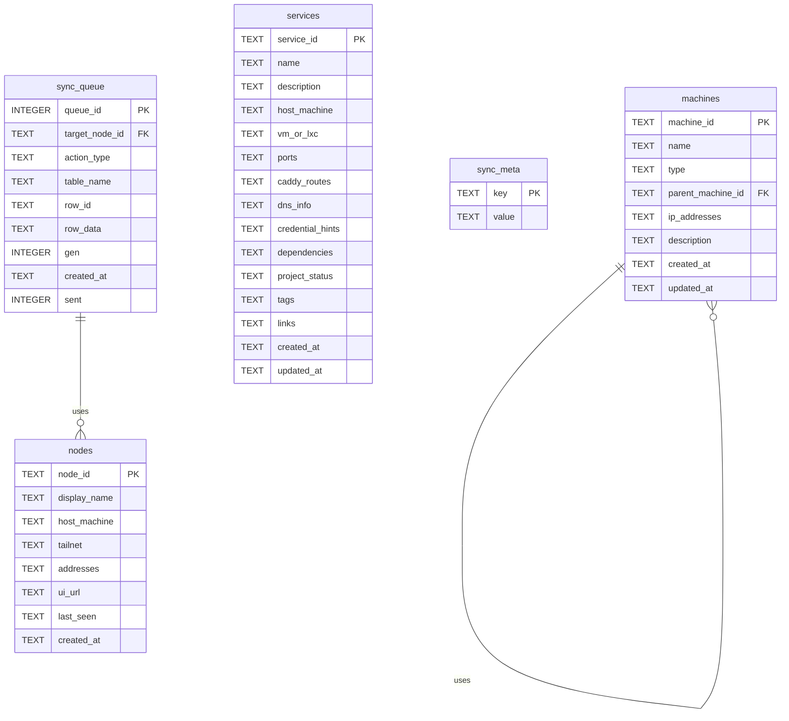

# Blueprints Database Relationships
*Generated: 2026-03-11 15:44:42*

```mermaid
erDiagram
    machines {
        TEXT machine_id PK
        TEXT name
        TEXT type
        TEXT parent_machine_id FK
        TEXT ip_addresses
        TEXT description
        TEXT created_at
        TEXT updated_at
    }
    nodes {
        TEXT node_id PK
        TEXT display_name
        TEXT host_machine
        TEXT tailnet
        TEXT addresses
        TEXT ui_url
        TEXT last_seen
        TEXT created_at
    }
    services {
        TEXT service_id PK
        TEXT name
        TEXT description
        TEXT host_machine
        TEXT vm_or_lxc
        TEXT ports
        TEXT caddy_routes
        TEXT dns_info
        TEXT credential_hints
        TEXT dependencies
        TEXT project_status
        TEXT tags
        TEXT links
        TEXT created_at
        TEXT updated_at
    }
    sync_meta {
        TEXT key PK
        TEXT value
    }
    sync_queue {
        INTEGER queue_id PK
        TEXT target_node_id FK
        TEXT action_type
        TEXT table_name
        TEXT row_id
        TEXT row_data
        INTEGER gen
        TEXT created_at
        INTEGER sent
    }
    machines ||--o{ machines : uses
    sync_queue ||--o{ nodes : uses
```
